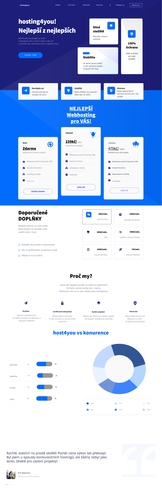

# Úvodní projekt do fimy

## [Možnost otevřít zde](https://radekpelikan.github.io/hosting4you/)

- úkolem bylo vytvořit webovou stránku podle přiloženého designu
- stránka by měla být responzivní
- použité technologie: HTML, CSS, JS, NPM, GIT, TailwindCSS, p5.js, vite.js

## Spustit projekt

1. **Stáhnout repozitář**

   `git clone https://github.com/RadekPelikan/hosting4you.git`

2. **Nainstalovat balíčky**

   `npm install`

3. **Spustit lokální server**

   `npm run dev`

4. **Otevřít webový prohlížeč na adrese**

   `http://localhost:3000/`

## Spustit projekt pro development

1. **Stáhnout repozitář**

   `git clone https://github.com/RadekPelikan/hosting4you.git`

2. **Nainstalovat balíčky**

   `npm install`

3. **Spustit lokální server**

   `npm run dev`

4. **Spustit watchery**

   `npm run watch:css`

   `npm run watch:js`

5. **Otevřít webový prohlížeč na adrese**

   `http://localhost:3000/`
